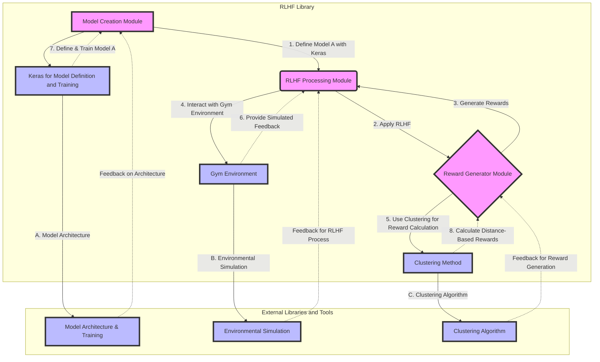

# Recomender 🚀

This repository houses the `recomender` Python package, a playful twist on "recommender". The essence of `recomender` is to enhance (mend) recommendation processes using Reinforcement Learning (RL) techniques.

## Architectural Concept



## Installation

To get started with `recomender`, clone this repository and install the required packages using the following commands:

```bash
git clone https://github.com/antunsz/recomender.git
cd your-repository-directory
make install
```

## Features

- **Distance-Based Reward Building:** Utilizes machine learning techniques to calculate rewards based on the distance between entities, improving the efficiency of recommendation systems.

- **Modular Design:** Easy integration into existing ML workflows, allowing for quick experimentation and deployment.

- **Customizable Reward Strategies:** Implement your own reward strategies by extending the `RewardBuilderAbstract` class.

## Quick Start

1. **Set up your environment**

   Ensure you have Python 3.8+ installed. Clone the repository and set up a virtual environment:

   ```bash
   python -m venv venv
   source venv/bin/activate
   ```

2. **Install dependencies**

   Use the `Makefile` to install the necessary dependencies:

   ```bash
   make install
   ```

3. **Run the examples**

   Check out the `examples/` directory to see `recomender` in action. For a quick start, run the Jupyter notebook:

   ```bash
   jupyter notebook examples/distance_based_reward.ipynb
   ```

## Development

To contribute to the development of `recomender`, you can use the following commands:

- **Install for development:**

  ```bash
  make setup
  ```

- **Run tests:**

  ```bash
  make test
  ```

- **Linting:**

  ```bash
  make lint
  ```

For detailed guidelines on contributing, please refer to the `CONTRIBUTING.md` file.

## License

This project is licensed under the MIT License - see the [LICENSE](LICENSE) file for details.

---

Happy recommending! 🎉
